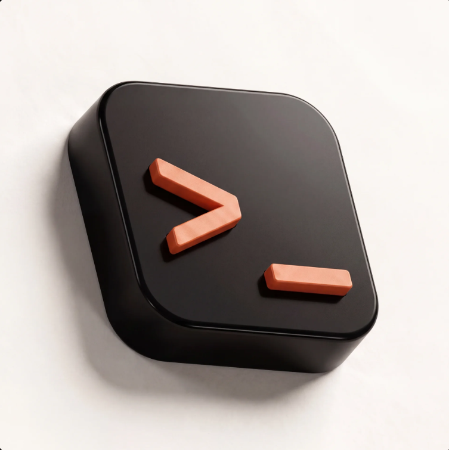
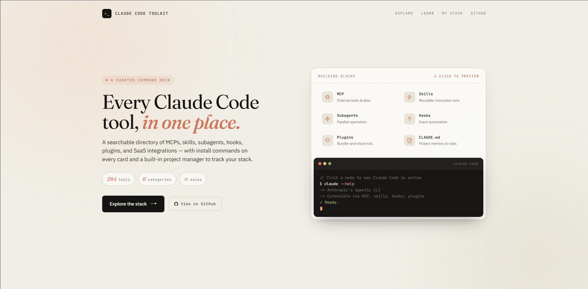

<div align="center">



# Claude Code Toolkit

**A curated command deck for Claude Code — 284 tools, categorized and installable.**

[](https://claude-code-toolkit-app.vercel.app)
[](https://nextjs.org/)
[](https://supabase.com/)
[](https://www.typescriptlang.org/)
[](LICENSE)

</div>

<br />

<div align="center">
  
</div>

<br />

## Why this exists

Claude Code's ecosystem moves fast. There are official Anthropic MCPs, community servers, agent frameworks, skill packs, SaaS integrations, and hook recipes — scattered across GitHub repos, npm, PyPI, Discord threads, and Twitter bookmarks.

**This is the single place to find, evaluate, install, and track them.** Every tool has a one-line install command, a short blurb explaining why it matters, and a direct link to its source. Sign in and save your stack across devices with credentials and notes stored privately.

## What's inside

| Route | What it does |
|---|---|
| **`/`** | Interactive landing with building-block previews (MCP, Skills, Subagents, Hooks, Plugins, CLAUDE.md) |
| **`/explore`** | Full directory — 284 tools, ranked search, 6 category filters, Top 5 featured |
| **`/learn`** | Education hub — curated YouTube videos, official courses with certificates, 4-phase roadmap |
| **`/stack`** | Your personal stack manager — projects, per-tool credentials (auth required) |
| **`/auth/sign-in`** | GitHub OAuth + email magic link — no password |

## Scope

**In scope:**
- Directory of MCPs, skills, agents, hooks, plugins, CLAUDE.md patterns, and SaaS integrations used *with* Claude Code
- Install commands, source links, category filters, full-text search
- User accounts + synced per-project credential storage
- Curated learning content (videos, courses, certificates)
- Community submissions (future)

**Out of scope:**
- Building Claude Code itself (that's Anthropic's job)
- Hosting user-built tools (link out to GitHub, don't mirror)
- General LLM directories (this is Claude Code-specific)
- A chat interface (Claude Code *is* the interface)

## Stack

| Layer | Choice | Why |
|---|---|---|
| Framework | **Next.js 16** (App Router, Turbopack) | Server components, file routing, Vercel-native |
| Language | **TypeScript** strict | Catches schema drift early |
| Database | **Supabase Postgres** | RLS + auth + storage in one free tier |
| ORM | **Drizzle** | Type-safe, lightweight |
| Auth | **Supabase Auth** | GitHub OAuth + magic link |
| Styling | **Tailwind v4** + CSS vars | Editorial palette, Claude brand colors |
| Hosting | **Vercel** | Preview deploys, 30s redeploys on push |
| Analytics | **Vercel Analytics** | Zero config |

## Design system

| Token | Value | Purpose |
|---|---|---|
| `--paper` | `#f0eee6` | Ivory background |
| `--ink` | `#141413` | Primary text / CTAs |
| `--accent` | `#cc785c` | Claude terracotta — links, highlights |
| `--term-bg` | `#181715` | Terminal background |
| `--term-accent` | `#e89b7d` | Brightened terracotta on dark |
| Serif | **Fraunces** | Display headlines (italic for accents) |
| Sans | **IBM Plex Sans** | Body copy |
| Mono | **JetBrains Mono** | Terminal, monospace UI, install commands |

## Local development

```bash
# Clone
git clone https://github.com/patty-png/claude-code-toolkit-app
cd claude-code-toolkit-app

# Install
npm install

# Set env — copy .env.local.example → .env.local and fill in:
# NEXT_PUBLIC_SUPABASE_URL
# NEXT_PUBLIC_SUPABASE_PUBLISHABLE_KEY
# SUPABASE_SERVICE_ROLE_KEY
# DATABASE_URL
cp .env.local.example .env.local

# Run schema (once) — paste ARCHITECTURE.md DDL into Supabase SQL editor

# Seed data (once)
node scripts/seed-categories.mjs
node scripts/migrate-v18-tools.mjs
node scripts/seed-education.mjs

# Dev server
npm run dev
```

Open [localhost:3000](http://localhost:3000).

## Foundation shipped

The core app (infra → directory → auth → synced stack) is live. Tags `phase-0` through `phase-5` on GitHub mark each checkpoint — `git checkout phase-N` to see the repo at that point.

| Tag | Shipped |
|---|---|
| `phase-0` | Next.js 16 + Supabase + Vercel CI |
| `phase-1` | 10-table schema, 8 categories seeded |
| `phase-2` | 284 tools migrated |
| `phase-3` | Landing + `/explore` + ranked search + Top 5 |
| `phase-4` | `/learn` — videos, courses, roadmap |
| `phase-5` | Auth + synced `/stack` with RLS credentials |

## What's next

Full plan in **[ROADMAP.md](ROADMAP.md)** with per-phase task checklists.

| Phase | Goal |
|---|---|
| **🟠 6 — Data scaling** *(in progress)* | Scrape MCP.so, Smithery, Glama, Anthropic official, awesome-lists → **284 → 1,000+ tools** with GitHub stars and install counts |
| 🟡 7 — Tool detail pages | `/explore/[slug]` with stats sidebar, README viewer, votes, related tools — match competitor UX |
| 🟡 8 — UI/UX overhaul | Stats on cards, sort controls, publisher grouping, `/marketplaces` page, loading skeletons |
| 🟢 9 — Community | Submissions + moderation queue, comments, leaderboards, shareable stacks |
| 🔵 10 — Integrations | Browser extension, CLI sync, Slack bot, public API, RSS feeds |

**Scraping sources** — the full prioritized list (Tier 1–4) is documented in **[SOURCES.md](SOURCES.md)**.

## Companion repo

The static single-file version lives at **[patty-png/claude-code-toolkit](https://github.com/patty-png/claude-code-toolkit)** — frozen at v18, used as the reference implementation and for minimal GitHub Pages deploys.

## Contributing

Got a tool that should be here?
1. Fork the repo
2. Add it to `scripts/migrate-v18-tools.mjs` with the right category
3. Open a PR — include the tool's official link, install command, and 1-line blurb

## License

MIT © 2026 [Jack Paterson](https://github.com/patty-png)
